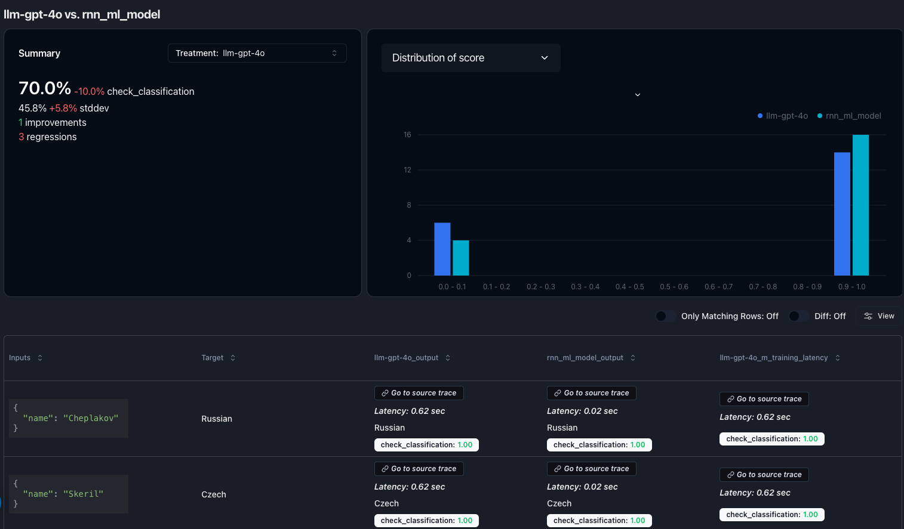

# ML Classification vs LLM Classification



This demo repo compares a Pytorch RNN model vs an LLM for simple classification tasks.

*RNN model [source](https://pytorch.org/tutorials/beginner/text_sentiment_ngrams_tutorial.html)*

## Environment Setup

_Copy the `.env.example` file to `.env` and fill in the values. Or export values in shell._

Set the `OPENAI_API_KEY` environment variable to access the [OpenAI](https://platform.openai.com) models.

Set the `PAREA_API_KEY` environment variable to access tracing
with [PareaAI](https://docs.parea.ai/integrations/langchain):

or export values in shell:

```bash
export OPENAI_API_KEY= <YOUR OPENAI API KEY>
export PAREA_API_KEY= <YOUR OPENAI API KEY>
```

## Get Started

```bash
pip install -r requirements.txt
```

Then run main/rnn_experiment.py

## Results

View experiment results on [Parea AI](https://app.parea.ai/experiments).